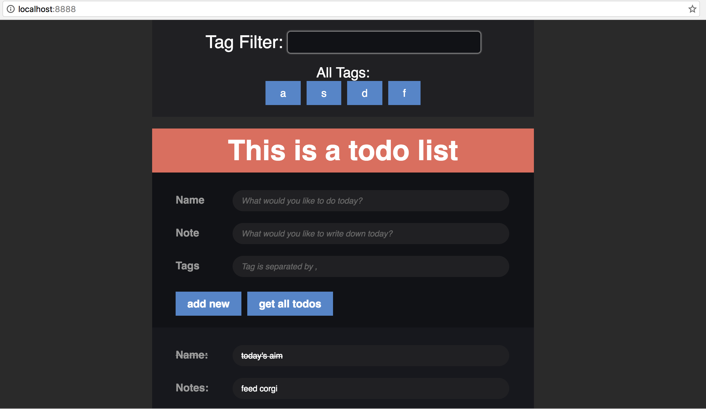

#VueJS  Todolist

Screenshot

##Introduction

A todo list implement by VueJS, nodejs, mongodb and mongoose, with unit test framework Karma and Jasmine.
It enables CURD operation for single todo list, add and edit tags, and search by tags.

#＃how to run:

1. git clone

2.npm install

3.install mongodb in windows
https://docs.mongodb.com/manual/tutorial/install-mongodb-on-windows/#run-mongodb-community-edition
in c, make dir c:/data/db as data directory. or specify another path use --dbpath

4.start mongo
mongod.exe and mongo.exe in MongoDB\Server\3.2\bin or whatever dir you installed

5.in your root dir
node server.js or npm run dev

6.tutorial
unit testing: https://vue-loader.vuejs.org/en/workflow/testing.html

for karma command line, need sudo npm install -g karma-cli
for show test results in browser
http://stackoverflow.com/questions/17289423/need-proper-reporter-for-karma-jasmine